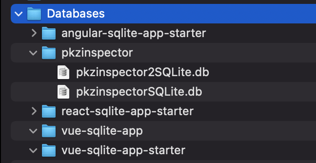

Build
```
yarn
yarn build
IF NEEDED -> npm install -g node-pre-gyp
yarn rebuild-electron
npx cap open @capacitor-community/electron
```
 Debug:
```
Dev Tools - cmd-P 
  open the Login.ts
break point on line 9
Click CreateDB on UI
Console Shows error
definitions.js
   line 79 shows connection created
   line 238 show open promise rejection

```

******************************
Added by Jeep 
******************************

after the git clone

```bash
yarn
cd electron
npm install
npm run build
cd ..
yarn build
npx cap sync @capacitor-community/electron
npx cap copy
npx cap copy @capacitor-community/electron
npx cap open @capacitor-community/electron
```

Result 
Show that the two databases have been created under the user folder



Hope this will help you and close the issue